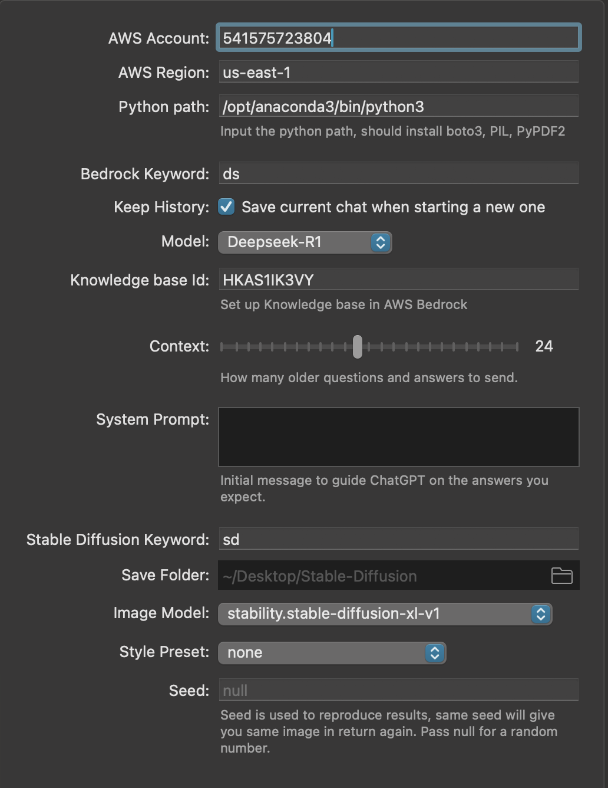
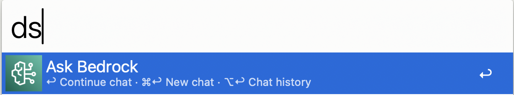
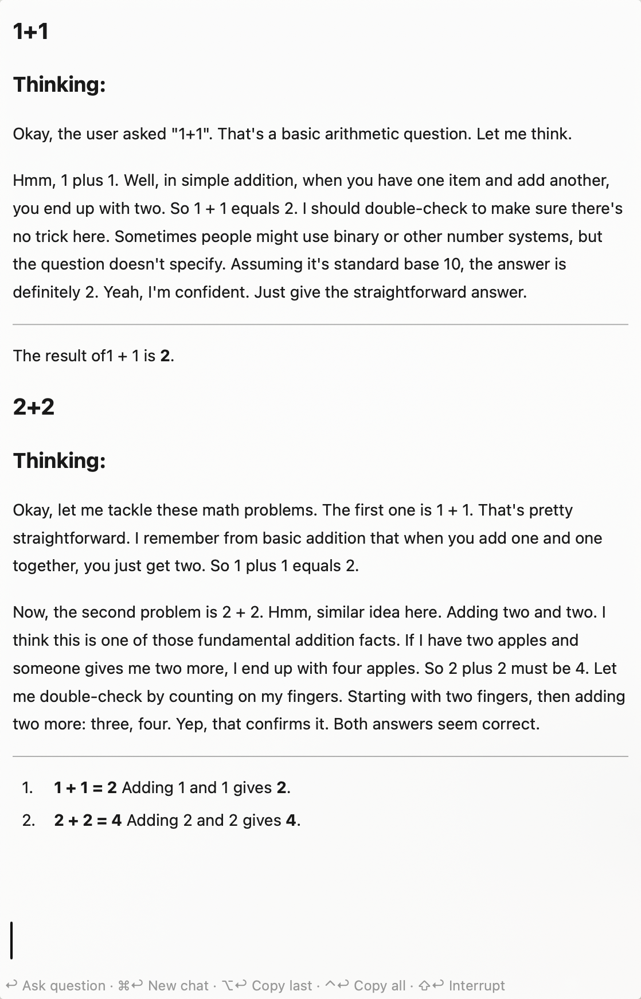
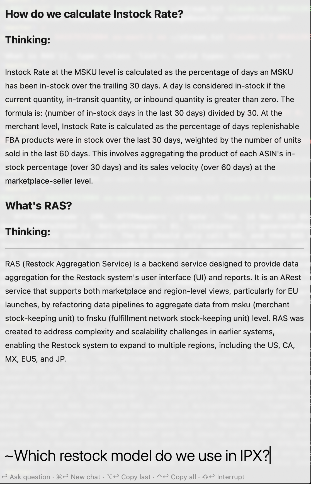
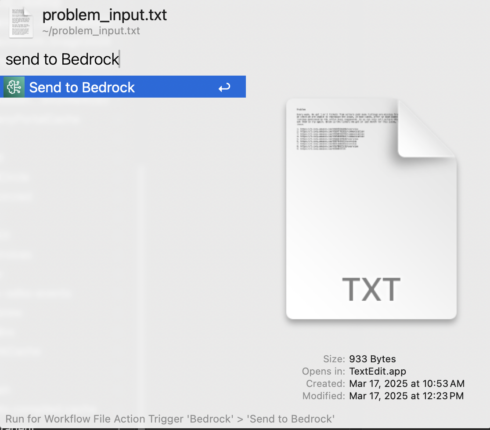
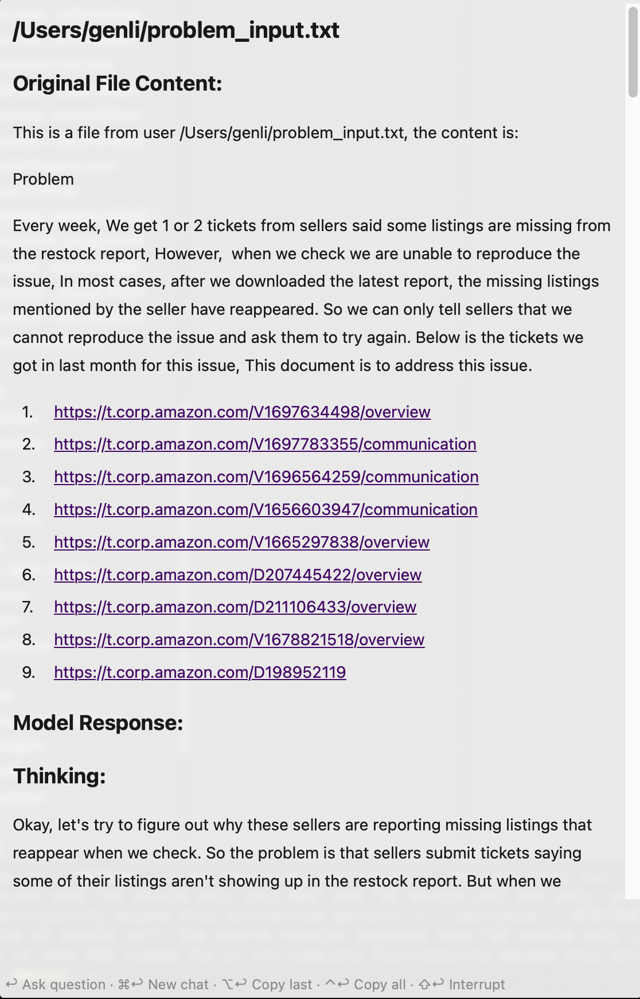
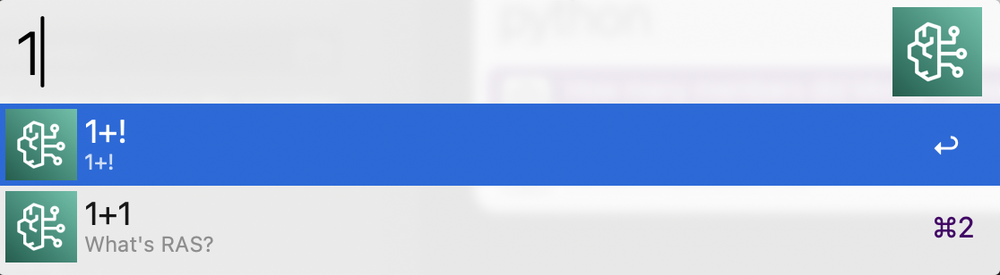
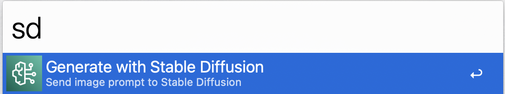
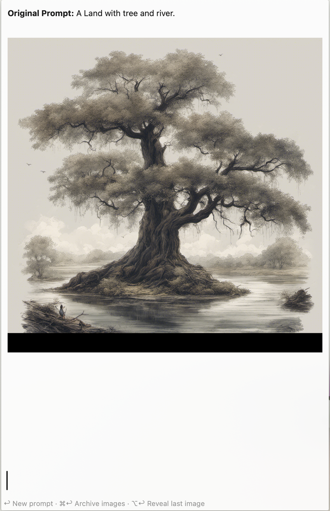

## Setup

1. Install Python(&gt;3.12), with libraies `boto3, PIL, PyPDF2`.
  * pip3 install boto3 PIL PyPDF2

2. Install [Ada](https://w.amazon.com/bin/view/DevAccount/Docs/), run `ada credentials update --account=[AWS ACCOUNT] --provider=conduit --role=IibsAdminAccess-DO-NOT-DELETE` to get AWS permission.

3. Update workflow configs, make sure all configurations match your expectations.

## Usage

### Bedrock

Query Bedrock via the `ds` keyword.

* &lt;kbd&gt;↩&lt;/kbd&gt; Ask a new question.
* &lt;kbd&gt;⌘&lt;/kbd&gt;&lt;kbd&gt;↩&lt;/kbd&gt; Clear and start new chat.
* &lt;kbd&gt;⌥&lt;/kbd&gt;&lt;kbd&gt;↩&lt;/kbd&gt; Copy last answer.
* &lt;kbd&gt;⌃&lt;/kbd&gt;&lt;kbd&gt;↩&lt;/kbd&gt; Copy full chat.
* &lt;kbd&gt;⇧&lt;/kbd&gt;&lt;kbd&gt;↩&lt;/kbd&gt; Stop generating answer.

---

Query personal knowledge base, with prefix '~'

---

Send file to bedrock

* Select file in Alfred and use `Send to Bedrock` command 

* Ask questions based on file

#### Chat History

View Chat History with ⌥↩ in the `ds` keyword. Each result shows the first question as the title and the last as the subtitle.

&lt;kbd&gt;↩&lt;/kbd&gt; to archive the current chat and load the selected one. Older chats can be trashed with the `Delete` [Universal Action](https://www.alfredapp.com/help/features/universal-actions/). Select multiple chats with the [File Buffer](https://www.alfredapp.com/help/features/file-search/#file-buffer).

### Stable Diffusion

Query Stable Diffusion via the `sd` keyword.

